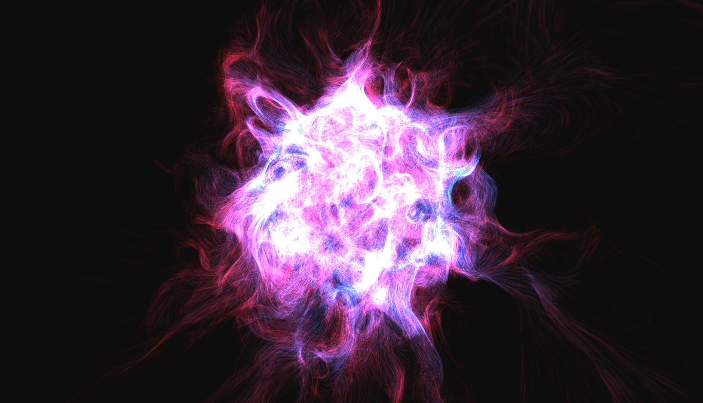
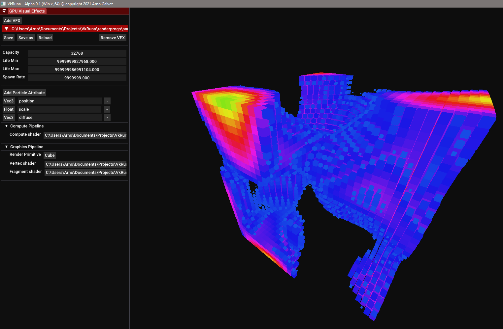
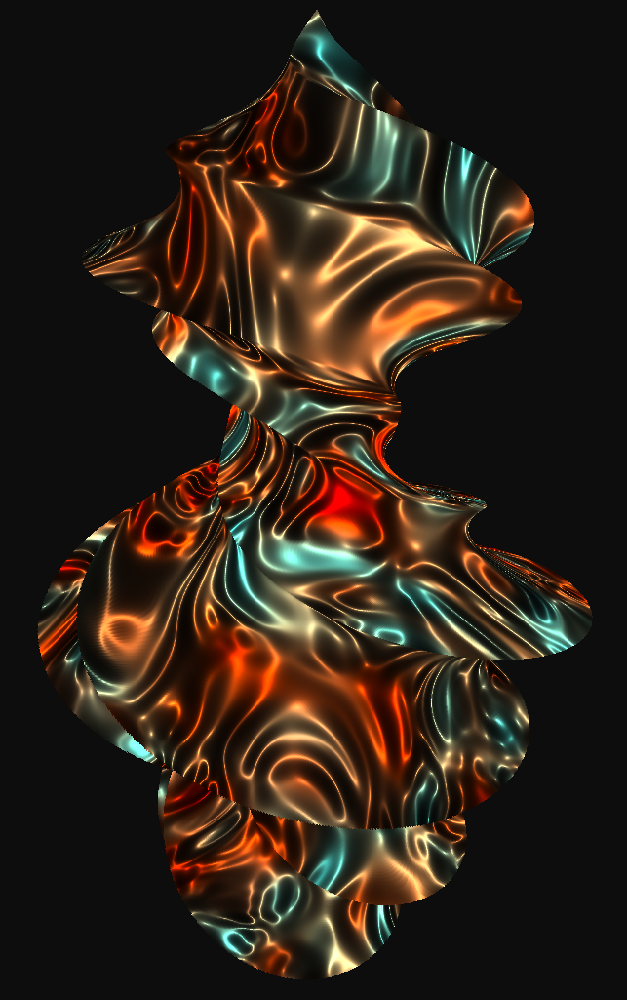

# VkRuna - A simple shader based VFX editor ✨



## Downloading the tool

Get it frome [here](https://github.com/arnoGalvez/VkRuna/releases).

## Building the tool

### Prerequisites

* Windows 10
* [CMake](https://cmake.org/download/)
* A 64 bits toolchain (eg x64, coming with Visual Studio 2019)

### Building
1. Generate a build configuration with CMake, e.g.:
```
cmake -S <path-to-source> -B <path-to-build> -G "Visual Studio 16 2019"
```
2. Open the project in your IDE, build and run !

## Utilisation

See the [Wiki](https://github.com/arnoGalvez/VkRuna/wiki).

## Samples




## About The Project

This project is part of my peregrination through the world of explicit rendering API and real time rendering. My goal was to make a simple GPU based VFX system. I first set out to recreate one of the example from Unity's VFX graph, the [particle swarm](images/samples/unity-swarm.png). Then, the renderer now being able to do simple VFX rendering, I moved onto making it a simple tool enabling real time modifications of the VFXs through UI exposed variables and on the fly shader recompiling.

I layed the foundation of this project using Pawel Lapinski's [API without secrets](https://software.intel.com/content/www/us/en/develop/articles/api-without-secrets-introduction-to-vulkan-part-1.html) tutorials, and then moved on to Dustin Land's [Vulkan blog series](https://www.fasterthan.life/blog). With Pawel I learnt the basics of Vulkan, and with Dustin I learnt the process of integrating a Vulkan rendering backend. I used my knowledge from a previous internship at Unity to design the UX for the VFX tool itself. Building the foundations was tedious, but the catharsis of seing my first animated particles was quite worth it !

The following SDK and libraries were used:
* [Vulkan](https://vulkan.lunarg.com/sdk/home)
* [glm](https://glm.g-truc.net/0.9.9/index.html)
* [Cereal](https://uscilab.github.io/cereal/)
* [Dear ImGui](https://github.com/ocornut/imgui)

## Contact

Arno Galvez - [Linkedin](https://www.linkedin.com/in/arnogalvez/)

Project Link: [https://github.com/arnoGalvez/vkRuna](https://github.com/arnoGalvez/vkRuna)


